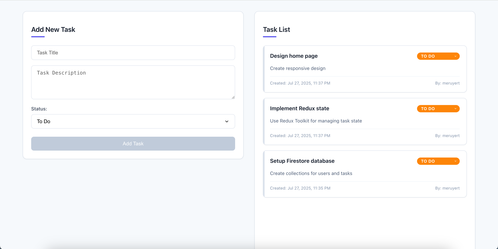
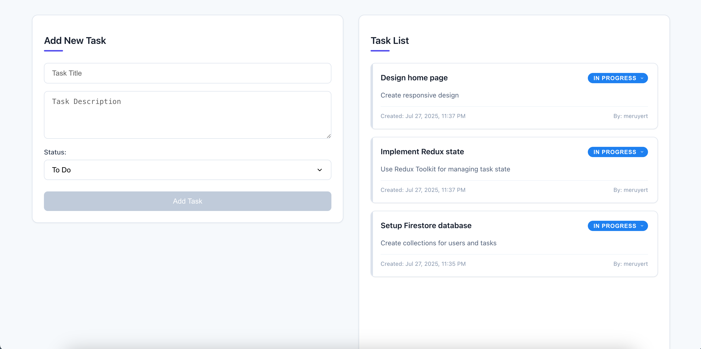
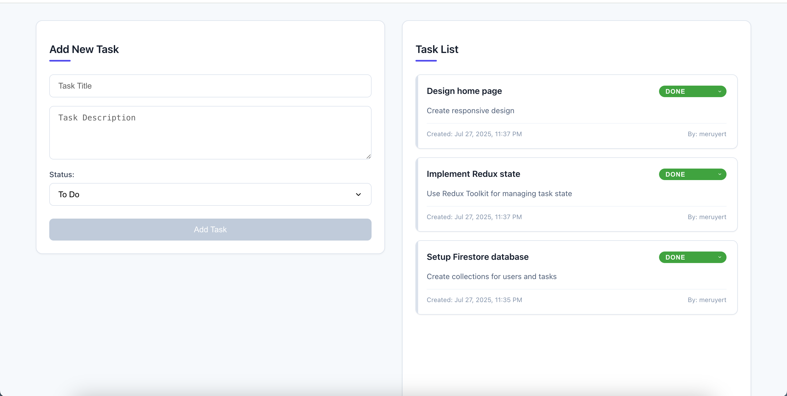

# Task Manager

A simple web-based task management application built with React, Redux Toolkit, and Firebase Firestore.

## Features

- **View Tasks**: Display all tasks with title, description, status, creation date, and creator name
- **Add Tasks**: Create new tasks with title, description, and initial status
- **Update Status**: Change task status between "To Do", "In Progress", and "Done"
- **Real-time Updates**: Tasks are stored in Firebase Firestore for persistence
- **Responsive Design**: Works on desktop and mobile browsers

## Task States

The application supports three task states:

- **To Do** (Orange): New tasks that haven't been started
- **In Progress** (Blue): Tasks currently being worked on  
- **Done** (Green): Completed tasks





## Setup

### Prerequisites
- Node.js (v14 or higher)
- Firebase account

### Installation

1. Clone the repository
```bash
git clone https://github.com/meruyert4/task-manager
cd task-manager
```

2. Install dependencies
```bash
npm install
```

3. Configure Firebase
   - Create a Firebase project at [Firebase Console](https://console.firebase.google.com/)
   - Enable Firestore Database
   - Create a `.env` file in the root directory with your Firebase configuration:
   ```
   REACT_APP_FIREBASE_API_KEY=your_api_key_here
   REACT_APP_FIREBASE_AUTH_DOMAIN=your_project_id.firebaseapp.com
   REACT_APP_FIREBASE_PROJECT_ID=your_project_id
   REACT_APP_FIREBASE_STORAGE_BUCKET=your_project_id.firebasestorage.app
   REACT_APP_FIREBASE_MESSAGING_SENDER_ID=your_messaging_sender_id
   REACT_APP_FIREBASE_APP_ID=your_app_id
   REACT_APP_FIREBASE_MEASUREMENT_ID=your_measurement_id
   ```

4. Start the application
```bash
npm start
```

The application will open at `http://localhost:3000`

## Project Structure

```
task-manager/
├── src/
│   ├── components/
│   │   ├── AddTaskForm.js    # Task creation form
│   │   └── TaskList.js       # Task display and management
│   ├── features/
│   │   └── tasks/
│   │       └── taskSlice.js  # Redux state management
│   ├── app/
│   │   └── store.js          # Redux store configuration
│   └── App.js               # Main application component
├── screenshots/             # Application screenshots
└── package.json
```

## Technologies Used

- **React**: Frontend framework
- **Redux Toolkit**: State management
- **Firebase Firestore**: Database
- **CSS**: Styling and responsive design

## Available Scripts

- `npm start` - Start development server